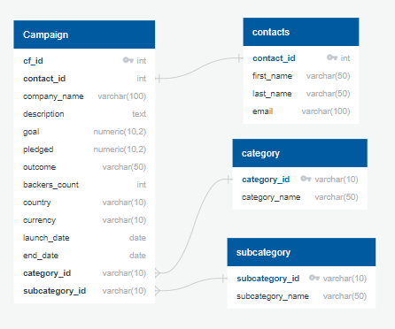
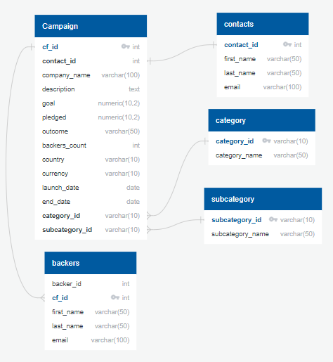

# ETL_Crowdfunding

## Background

Using Python, Pandas, and Jupyter notebooks to do the extract and transform phases. Extract and transform the backers’ contact information from a CSV file to create a DataFrame that will be exported as a CSV file. Use the dataset to create an ERD and a table schema for creating a new table in the crowdfunding_db database. Upload the CSV file that contains the backers’ information into this table. 

## ERD used during the module

## ERD used for Module Challenge
